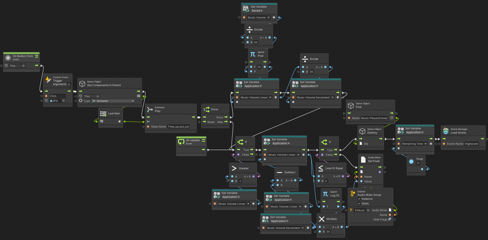
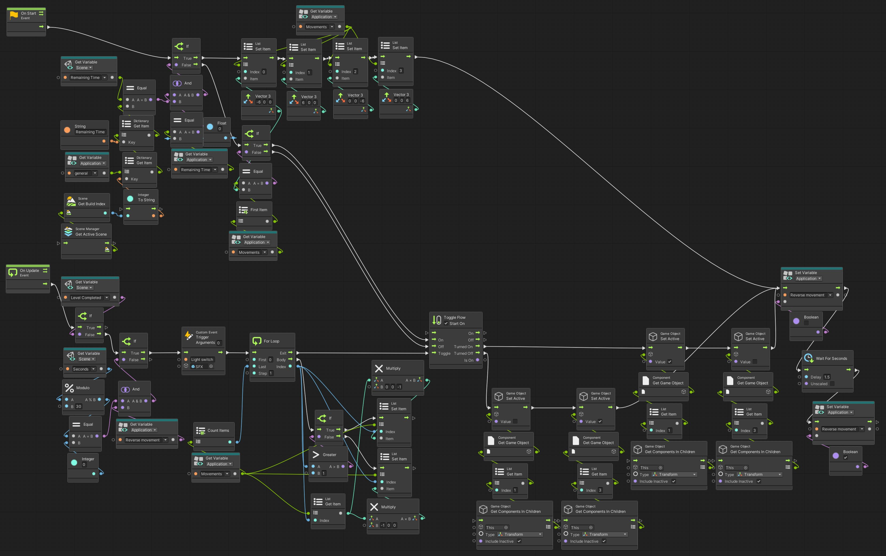

<h1 align="center"><br>
  <strong>Atomremix</strong>
  <br>
</h1>

<h4 align="center">This game was developed using the Unity engine, inspired by the classic Amiga game Atomix.</h4>


<p align="center">
  <a href="#about">About</a> •
  <a href="#how-it-works">How It Works</a> •
  <a href="#installation-note">Installation Note</a>
</p>

<div style="text-align:center">
<p>Video: <a href="https://youtu.be/Xc2SA4VOqKU?si=xd5agQ-wLdQ8Wfyl">https://youtu.be/Xc2SA4VOqKU?si=xd5agQ-wLdQ8Wfyl</a></p>
<p>Android App: <a href="https://play.google.com/store/apps/details?id=com.accaderi.Atomremix&pcampaignid=web_share">https://play.google.com/store/apps/details?id=com.accaderi.Atomremix&pcampaignid=web_share</a></p> 
</div>

>Atomix is a classic puzzle video game that was originally developed and released in 1990 for the Amiga computer. The game was created by Thalion Software and designed by Günter Krämer.
>
>Atomremix is a remake of the classic Atomix game, specifically designed for Android operating systems and touch screen devices.

# About

`Atomremix` unfolds on a playfield defined by walls, with atoms scattered throughout. The player's mission is to construct a molecule by arranging the atoms to precisely match the displayed molecule on the right side of the screen.  Atom movement is facilitated by swiping in four directions—up, down, left, and right. The moved atom continues sliding until it encounters a wall or another atom.

To solve the puzzles, players need strategic planning in atom movement. As the levels progress, with limited free space, finding room for the completed molecule becomes an additional challenge. Upon successful assembly of the molecule, the player receives a score, with a higher score awarded for completing the puzzle more quickly.

Each puzzle must be solved within a time limit. If a puzzle proves challenging, a portion of the player's score can be utilized to restart it.

The game comprises a total of 15 puzzles, each increasing in difficulty. Some levels may introduce twists and special features, adding an extra layer of difficulty and strategy.

Moreover, after completing every four puzzles players are treated to a bonus level, enhancing the gaming experience with additional challenges and surprises.


# How It Works

The game was developed using the Unity engine. Visual scripting was primarily employed for coding, with certain sections utilizing C# script e.g. Highscore. The `Simple Playlist Player` from the Unity Asset Store was used for the music player.

## Scenes

* Start
* Congrats
* Highscore
* Time_out_but
* Settings
* Level 1 to Level 15

### **Start Scene**

The Start scene serves as the main scene when the game begins.

#### Available options:

* Start button: initiates the game from level 1.
* Start from level button: becomes available only when the player completes the game on a level higher than 1.
* Quit button: exits the game.
* Volume icon (bottom right corner): toggles the music of the start scene on/off.

#### Scripts:

**Initialize the game** (init_everything_from_start) [Main Menu]

On Start:
1. Check if the reached level higher than 1 to activate the start from level button
2. Initialise and set all application variables to the default value.
(The `Hiding atoms` Application variable needs to have a corresponding scene variable so that the script can reset the Application variable with the values stored in the Scene variable.)
3. Destroys the smoke object if the player is coming from level 6.

**Start button click** (start_button_clicked) [Start button]  

On Button Click:
1. Set level reached to 1 and score to 0.
2. Plays ‘start_scene_out with fade out audio’ animation and load level 1 scene

**Start from level button** (start_last_level_button) [Start The Last Level]  

On Button Click:
1. Set score 0.
2. Set ‘From start menu’ variable to True to let the actual start level to know to start the music on the level.
3. Plays ‘start_scene_out with fade out audio’ animation and load the level reached scene

**Quit button** (Quit_button_click) [Quit]

On Button Click:
1. Plays ‘start_scene_out with fade out audio’ animation and quit the game

**Music Off icon - button** (start_music_button) [Music Off]\

On Start:
1. Set the Dont Destroy On Load app variable to null to notify the level to play to start the level music.
2. As per the ‘Start Music’ saved variable either activate or deactivate the music in the Start scene.

On Button Click:

3. Deactivate / Activate the music game object which on awake plays with loop the start scene music.

**Init Sound Volume** (init_sound_volume) [Sound Manager Unique]  

On Start (coroutine):
1. Set the 'Music Volume Linear' and 'Music Volume Decrement' variables to -1 to disable the Fade out music sequence check in the relevant scripts (win_sequence and timer).
2. Initialize the music volume based on the saved volume.
3. Wait for one frame to avoid unintended SFX playback.
4. Activate and set the volume of SFX.
5. Set the Audio Listener Pause to False.

**Dont Destroy Music First Start** (destroy_music_player_first_start) [Sound Manager Unique]
  
1. Destroy either the Music Player Bonus(Clone) or the Music Player (Clone)

**Define SFXs** (sfx) [SFX]
.jpg)  
1. Defines all SFX for the game as 'Custom Events'.

### **Time_out_but Scene**

The purpose of this scene is to provide the option for the user to retry the actual level without losing the current score for 20,000 points.

#### Available options:

* Yes button: player accepts the deal and restarts the level, keeping the score after deducting 20,000 points.
* No button: player declines the deal, and the next scene is 'Highscore'.

#### Scripts:

**Remove 20,000 points** (life_for_points) [Yes button]
  
On Start:

1. Initializes and sets all application variables to default values.
2. Destroys the smoke object if the player is coming from level 6.

On Button Click:

3. Removes 20,000 points from the actual score.
4. Plays 'Time_up_but_out' animation.

**Declined to buy life** (declined_to_buy_life) [No button]
  
On Button Click:
1. Plays 'time_out_but_out' animation.

On Update (If block):

2. Fades out the volume.
3. Destroys 'Music Player(Clone)' object.
4. Sets 'Remaining time' variable to 0.
5. Loads 'Highscore' scene.

### **Congrats Scene**
The congratulation scene appears after the player completes all levels.

#### Available options:
1. Click on the background: proceeds to the 'Highscore' scene.
2. Wait for the animation to complete.

#### Scripts:
**Init Sound Volume** (init_sound_volume) [Sound Manager Unique]  
Same as in the 'Start Scene'

**Start the music** (destroys_music_player_first) [Sound Manager Unique]
 
On Start:
1. Checks if the actual level is in the 'Music Change' list.
2. If true, destroys Music Players.
3. Checks if 'Dont Destroy On Load' exists and 'remaining Time' is 0; if true, it means we start the scene and there was a music player destroyed in item 2.
4. Sets the 'Dont Destroy On Load' variable to null to completely remove the old music player and let the new one initialize a new 'Dont Destroy On Load' variable with the new music player object.
6. Creates a clone from the music player object and activates it.

**Congrats to Highscore** (congrats_to_next) [Canvas]
  
On Update:

1. When the animation is finished, sets 'Congrats completed' application variable to True to notify the 'Highscore' scene to start with a white background and fade it out.

On Mouse Input (Left Button Down):

2. Loads 'Highscore' scene when the user clicks on the screen.

**Dont Destroy On Load with One Instance** (DontDestroyOnLoad) [Music Player Congrats]
  
  
On Start:

1. If there is a 'DontDestroyOnLoad' list Application variable, check if it is null.
2. If yes, create an empty list as a variable.
3. If not, create an 'Exist_' Flow variable set to False.
4. Loop through the list and check if the Object is on the list. If yes, set the 'Exist_' Flow variable to True and break from the loop.
5. If 'Exist_' is True, exit from the script.
6. Else, add the Object name to the list and exit.

### **Settings Scene**

This scene provides game settings for the user, accessible by clicking the 'Gear' icon on any level.

#### Available options:
* Set music volume with the slider.
* Set SFX volume with the slider.
* OK button: sets the values for music and SFX and goes back to the level.
* Reset button: reverts the volumes to the last set values.
* OK and start menu button: saves the volumes and returns to the 'Start' scene.

#### Scripts:

**Change sound volumes** (sound_volume) [Settings Menu]
  
On Start:
1. Sets music and SFX Scene variables as the corresponding Saved variables and sets the slider values accordingly (using pow conversion to get linear values for the sliders).

On Update (If):

2. Gets hold of the sliders and listens to the select and deselect events.
3. Uses the 'Set Ignore Listener Pause' method since the level music (Audio Source) is on pause at the moment.
4. Based on the changed slider values, sets the 'Music Volume' or 'SFX Volume' Scene variables and sets the Audio Mixer Group Volumes accordingly (using log conversion to get the proper values for the Audio Mixer Volumes).

**Settings OK button** (settings_ok_button) [OK button]
  
On Button Click:
1. Plays the click sound effect (SFX) for the button.
2. Sets the 'Music Volume' and 'SFX Volume' Saved variables to the user-defined values.
3. Plays the 'Time_up_but_out' animation and returns to the current level.

**Reset Audio Settings To The Last Saved Values** (settings_ok_button) [Reset Button]
  
On Button Click:
1. Sets the Scene music and SFX variables to the Saved ones and adjusts the sliders accordingly using power (pow) conversion.

**Settings Return to Start Menu** (settings_mainmenu_button) [Start Menu Button]
  
On Button Click:
1. Sets the Saved music and SFX volumes according to the Scene variables.
2. Destroys the 'Music Player(Clone)' object.
3. Plays the 'Time_up_but_out' animation and loads the 'Start' scene.

**Init Sound for Settings** (init_sounds_for_settings) [Sound Manager]
  
On Start:
1. Sets the Audio Mixer Group music and SFX volumes as per the corresponding Saved variables.

### **Highscore Scene**
A record of the top players' scores.
Available options:
Provide a name if the score is high enough to be registered in the highscore table.
Click on the screen to return to the 'Start' scene.
Scripts:
Init Sound Volume (init_sound_volume) [Sound Manager]
Highscore General Script (highscore) [Highscore Table]
On Mouse Input (Right Button) - inactive
Reinitialize the highscore table with default values.
On Start:
If coming from the 'Congrats' scene, the screen fades in from white.
Generate the highscore considering the user score using the C# script 'HighscoreTable'.
On Update:
If the name is registered as per the C# script logic, wait for additional mouse click or touch to proceed to the scene end sequence.
Start the 'Highscore_out' animation.
Check which music player is active.
Initialize the Music Volume Application Variables for the correct start volume and decrement unit for the audio fade out.
On Update (If):
Fade out the music volume.
Destroys the active music player.
Sets the 'Congrats completed' Application variable to false.
Loads the 'start' scene.

#### Scripts:

**HighscoreTable script (HighscoreTable.cs)**  
```c#
/* 
Based on Code Monkey’s code, it has been extensively modified, optimized, reorganized, and enhanced with new functions.
 */

using System.Collections.Generic;
using UnityEngine;
using UnityEngine.UI;
using TMPro;


public class HighscoreTable : MonoBehaviour {

    public int score;
    private new string name;
    public int namePosition;
    public bool nameRegistered;
    private Transform entryContainer;
    private Transform entryTemplate;
    private List<Transform> highscoreEntryTransformList = new List<Transform>();
    private Highscores highscores = new Highscores();
    public TMP_InputField inputField;
    public TextMeshProUGUI textScore;
    public GameObject playerScoreTitle;

    // private void Awake() {

    //     CreateHighscore(score, name);

    // }
    public void CreateHighscore(bool nameEntered = false){
        entryContainer = transform.Find("highscoreEntryContainer");
        entryTemplate = entryContainer.Find("highscoreEntryTemplate");

        entryTemplate.gameObject.SetActive(false);

        string jsonString = PlayerPrefs.GetString("highscoreTable");
        this.highscores = JsonUtility.FromJson<Highscores>(jsonString);

        if (namePosition != 0 && nameEntered == true) {
            this.highscores.highscoreEntryList.RemoveAt(namePosition - 1);
            AddHighscoreEntry(score, name.ToUpper());
        }

        if (this.highscores == null) {

            highscores = new Highscores() {
                highscoreEntryList = new List<HighscoreEntry>()
            };

            // There's no stored table, initialize
            Debug.Log("Initializing table with default values...");
            AddHighscoreEntry(85000, "TOM");
            AddHighscoreEntry(82500, "HRI");
            AddHighscoreEntry(80000, "RPI");
            AddHighscoreEntry(77500, "XTA");
            AddHighscoreEntry(75000, "AKI");
            AddHighscoreEntry(72500, "DTA");
            AddHighscoreEntry(70000, "CCS");
            AddHighscoreEntry(67500, "ACC");
            AddHighscoreEntry(60000, "GST");
            AddHighscoreEntry(55000, "LOW");
        }
       
        if (this.highscores.highscoreEntryList[this.highscores.highscoreEntryList.Count - 1].score >= score && !nameEntered) {
            SetTextScore();
            nameRegistered = true;
        }

        if (this.highscores.highscoreEntryList[this.highscores.highscoreEntryList.Count - 1].score < score) {
            // Do not show your score if score is on the highscore table
            playerScoreTitle.gameObject.SetActive(false);
            textScore.gameObject.SetActive(false);

            this.highscores.highscoreEntryList.RemoveAt(this.highscores.highscoreEntryList.Count - 1);
            AddHighscoreEntry(score, name);
        }

        // Sort entry list by Score
        for (int i = 0; i < this.highscores.highscoreEntryList.Count; i++) {
            for (int j = i + 1; j < this.highscores.highscoreEntryList.Count; j++) {
                if (this.highscores.highscoreEntryList[j].score > this.highscores.highscoreEntryList[i].score) {
                    // Swap
                    HighscoreEntry tmp = this.highscores.highscoreEntryList[i];
                    this.highscores.highscoreEntryList[i] = this.highscores.highscoreEntryList[j];
                    this.highscores.highscoreEntryList[j] = tmp;
                }
            }
        }
        
        string json = JsonUtility.ToJson(this.highscores);
        PlayerPrefs.SetString("highscoreTable", json);
        PlayerPrefs.Save();

        if (highscoreEntryTransformList != null) {

            foreach (Transform clone in highscoreEntryTransformList)
            {
                Destroy(clone.gameObject);
            }

            // Clear the list after destroying all clones
            highscoreEntryTransformList.Clear();
        }

        foreach (HighscoreEntry highscoreEntry in highscores.highscoreEntryList) {
            CreateHighscoreEntryTransform(highscoreEntry, entryContainer, score);
        }
        if (namePosition != 0 && string.IsNullOrWhiteSpace(name)) {

            // InputFieldHandling(score);
            RectTransform tmpRect = inputField.GetComponent<RectTransform>();
            tmpRect.anchoredPosition = new Vector2(175, 109 -31f * (namePosition - 1));
            inputField.text = "";
            inputField.gameObject.SetActive(true);

            // Set the focus to the inputfield
            inputField.Select();
            inputField.ActivateInputField();

            inputField.onEndEdit.AddListener(OnInputSubmitted);
            }

    if (nameEntered == true) {
        name = "";
        nameRegistered = true;
        namePosition = 0;
        }

    }

    public void OnInputSubmitted(string inputText){

                if (string.IsNullOrWhiteSpace(inputText)) {
                    // inputText = "-";
                    inputField.Select();
                    inputField.ActivateInputField();

                } else {
                inputField.onEndEdit.RemoveListener(OnInputSubmitted);
                inputField.gameObject.SetActive(false);
                name = inputText;
                inputField.text = "";
                CreateHighscore(true);
                }
    }

    public void SetTextScore() {
        namePosition = 0;
        name = "";
        textScore.text = score.ToString();
        playerScoreTitle.gameObject.SetActive(true);
        textScore.gameObject.SetActive(true);
    }

    private void CreateHighscoreEntryTransform(HighscoreEntry highscoreEntry, Transform container, int score) {
        
        float templateHeight = 31f;
        Transform entryTransform = Instantiate(entryTemplate, container);
        RectTransform entryRectTransform = entryTransform.GetComponent<RectTransform>();
        entryRectTransform.anchoredPosition = new Vector2(0, -templateHeight * this.highscoreEntryTransformList.Count);
        entryTransform.gameObject.SetActive(true);

        int rank = this.highscoreEntryTransformList.Count + 1;
        string rankString;
        switch (rank) {
        default:
            rankString = rank + "TH"; break;

        case 1: rankString = "1ST"; break;
        case 2: rankString = "2ND"; break;
        case 3: rankString = "3RD"; break;
        }

        entryTransform.Find("posText").GetComponent<TextMeshProUGUI>().text = rankString;

        int local_score = highscoreEntry.score;

        entryTransform.Find("scoreText").GetComponent<TextMeshProUGUI>().text = local_score.ToString();

        string local_name = highscoreEntry.name;
        entryTransform.Find("nameText").GetComponent<TextMeshProUGUI>().text = local_name;
            
        if (local_score == score && string.IsNullOrWhiteSpace(local_name)){
            namePosition = rank;
        } 

        // Set background visible odds and evens, easier to read
        entryTransform.Find("background").gameObject.SetActive(rank % 2 == 1);
        
        // Highlight First
        if (rank == 1) {
            entryTransform.Find("posText").GetComponent<TextMeshProUGUI>().color = Color.green;
            entryTransform.Find("scoreText").GetComponent<TextMeshProUGUI>().color = Color.green;
            entryTransform.Find("nameText").GetComponent<TextMeshProUGUI>().color = Color.green;
        }

        // Set trophy
        switch (rank) {
        default:
            entryTransform.Find("trophy").gameObject.SetActive(false);
            break;
        case 1:
            entryTransform.Find("trophy").GetComponent<Image>().color = HexToColor("#FFD200");
            break;
        case 2:
            entryTransform.Find("trophy").GetComponent<Image>().color = HexToColor("#C6C6C6");
            break;
        case 3:
            entryTransform.Find("trophy").GetComponent<Image>().color = HexToColor("#B76F56");
            break;

        }

        this.highscoreEntryTransformList.Add(entryTransform);
    }

    private Color HexToColor(string hex)
        {
            Color color = Color.white;
            ColorUtility.TryParseHtmlString(hex, out color);
            return color;
        }
    private void AddHighscoreEntry(int score, string name) {
        // Create HighscoreEntry
        HighscoreEntry highscoreEntry = new HighscoreEntry { score = score, name = name };

        // Add new entry to Highscores
        this.highscores.highscoreEntryList.Add(highscoreEntry);
    }

    public void setOriginalHighscore(){
        PlayerPrefs.DeleteAll();
    }

    public class Highscores {
        public List<HighscoreEntry> highscoreEntryList;
    }

    /*
     * Represents a single High score entry
     * */
    [System.Serializable] 
    public class HighscoreEntry {
        public int score;
        public string name;
    }

}
```
It is a C# script using different variables to achieve the following general logic:

The main function is the 'CreateHighscore' function.
1. For the first run, check if there is already a saved highscore and load it if it exists; otherwise, create a highscore with default values.
2. Insert the player's score if it is high enough.
3. If the player's score is not high enough, it will not be inserted in the highscore entries and will be displayed prominently under the highscore entries.
4. Sort the entries by scores.
5. If the highscore entry transform list is not empty, it needs to be emptied to avoid creating new clone entries without deleting the old ones.
6. If the name has to be entered by the player, place the input field on the appropriate line according to the rank and do not allow exit without typing something.
7. Set the variables to the default values after completing the final highscore.

The 'OnInputSubmitted' function handles the user name input.

8. Only accept the input if something is entered.

The 'SetTextScore' function handles the score if it is not high enough to show among the highscore entries.

9. Write the score under the 10th highscore entry.

The 'CreateHighscoreEntryTransform' function creates the entries on the screen by cloning the template entry object.
Among the main functions like handling the last two letters of the ranks, highlighting the first-ranked player, and awarding trophies to the top 3 players, it does the following:

10. If the player's name is on the highscore list, define its rank in the 'namePosition' variable to indicate to the 'CreateHighscore' function for the second run that it needs to insert the input field into the ranked row in the highscore.

The 'HexToColor' function converts the color to the trophy 'Image.'

The 'setOriginalHighscore' deletes the existing saved highscore.

**Highscore General Script** (highscore) [Highscore Table]
  
On Start:
1. If Congrats watched till the end the Highscore scene is fading in from white else from black
2. Using the C# script display the highscore

On Update:  

3. Get name registered first (if the score is high enough checked by the highscore C# script)
4. After click on the screen start the 'Highscore_out' animation from black
5. Take the name of the active music player into the 'Active Music Player' Scene variable
6. Sets the music volume Application variables to start the music fade out

On Update:

7. If the music volume Scene variables set fade out the music
8. Destroy the current music player object
9. Set the 'Congrats completed' Application variable to False
10. Load the 'Start Scene'

On Mouse Input Right:
11. Runs the 'Set Original Highscore' method from the C# script to set the original highscore (not used in the game)

### **Level Scenes**

#### **Levels in General:**

**Base Level UI:**  
Contains the Main Camera and the Directional Light.

**UI Elements:**  
Score, Time, Level, Gear Icon (button), Molecule Name, and Shape.  
Start-End Effect Image for fade in and out of the levels (Raycaster component is not added since it deactivates after the animation is done).

**Objects to Control Level General Behavior:**  
`Game Control`: Responsible for controlling the atom/clickable object movements.
`Atoms`: Multipurpose object. The parent of all main changing objects and UI elements. As the main animator of the levels, it handles the final animations, initializes the atom start position, and runs the win sequence script.  
`Collision Detector`: Handling atom collisions, maintains the clickable object positions, and checks if the player completed the molecule.

**3D Game Objects:**  
`Walls` and `Floor`: Generated with ProBuilder using Mesh Renderer and Mesh Collider.  
`Atom clickable object`:
An atom object consists of the body and a connection child element. The atom has a box collider, while the connection has several colliders using the trigger-only option. The atom's box collider has material friction turned off; its size is determined to avoid touching any other object while occupying a certain field of the grid or sliding straight along the x or z-axis.
Atom objects have rigid bodies with gravity turned off and freeze rotation along all axes. They have the 'Position Constraint' component to maintain a straight travel path while moving along the x or z-axes.
The connections have a spark effect when touching certain connections, generally straight to straight and inclined to inclined.

**Effect Objects:**  
`Spark Area Light` consists of an area light and a particle effect of an electric shock.
`Force Field` and `Force Field (1)` are the end scene explosions.

**Sound Manager:**  
There are two types of sound managers, one for levels to start a new music playlist and one for levels to start a playlist only if the level is chosen from the 'Start' scene by clicking on the 'Start from level' button.

**Music Playlists:**
- Levels 1-4 utilize the 1st
- Levels 6-9 utilize the 2nd
- Levels 11-14 uses the 3rd music playlist
- The bonus stages, specifically levels 5, 10, and 15, have their own distinct music tracks.

**Lights:**
In general, most levels contain one directional light and several point lights.

#### Available Options:
Swipe the atoms, click/touch atoms, and swipe them in the desired direction.
Click on the gear icon (button) to access the settings menu and pause the game.

#### Scripts:
**Swipe The Molecule** (atom_behaviour) [Game Control]  

On Mouse Input (Left Button Down):
1. If the Clicked Object is null, register the touch position, touch time, and place the clicked object into the 'temp clicked object' Graph variable.

On Mouse Input (Left Button Up):

2. Check if a swipe happened, considering the mouse button up time and position compared to the touch-in time and the touch-down position.
3. If a swipe indeed happened, check the direction of the swipe and lock all movements of the atom except the axis of the swipe direction.
Set the velocity of the atom accordingly.
4. Plays sound effect.
5. Clear the 'temp clicked object' Graph variable.
6. Activates the 'Collision Detector' object and deactivates itself.

**Collision Handler** (collision_handler) [Collision Detector]


On Collision Enter:

1. Perform a null check and set the velocity of the 'Clicked Object' to 0.
2. Arrange its position to be in the middle of the actual field of the grid, with Y being constant at -0.5.
3. Compare the tags of the collider and the 'Clicked Object' and regulate the position of the collider if it is an atom or clickable object too.
4. If the 'Spark Area Light' object is active (which occurs when the connection trigger and collision of the clicked object with a wall or another atom happen simultaneously), wait for 0.07 seconds to allow the effect to take place, and then deactivate the 'Spark Area Light' object.
5. If the 'Sparks Detected' Scene variable is True, run the atom position check loop to determine if the player completed the molecule.
    - Loop through all the atoms and check their positions compared to the position of the atom tagged 'Atom Zero'. Atom number is calculated as all the child elements of the 'Atoms' object minus the non-atoms/clickable objects. The loop finishes either if it found any atoms in the wrong position or checked all the atoms, meaning the total number of atoms equals the index/2 of the main loop. The step is two because each atom has the connection as a child. The 'no chance' variable is used to indicate if the molecule is not completed.
    - If the 'no chance' variable is False:
        - Sets the 'Level Completed' Scene variable to True.
        - Starts the 'Level Completed' SFX.
        - Deactivates the Game Controller object and itself.
    - If it is True:
        - Sets the 'no chance' Graph variable to False.
        - Sets the 'Clicked Object' variable to null.
        - Activates the Game Controller object and deactivates itself.
6. If it is False:
    - Sets the 'Clicked Object' variable to null.
    - Activates the Game Controller object and deactivates itself.


On Trigger Enter:

7. If two connections collide, indicated by their tags being either 'Connection' or 'Connection v1':

    - If the clicked atom's 'x' velocity is 0, it is moving along the 'z' axis.
        - If the 'x' coordinate of the position of the clicked object and the collider object is less than the tolerance (indicating frontal collision along the 'z' axis):
            - If both objects are 'Connection v1', a distance check is required to determine if they are in a real collision, meaning the connection cylinder base circle faces are close to parallel. If they are too close, there is no need for a spark effect; otherwise, the spark effect is invoked.
        - If the 'x' coordinate of the position of the clicked object and the collider object is more than the tolerance (indicating side collision along the 'z' axis):
            - If both objects are 'Connection v1', a simple spark position calculation applies (middle of the two objects).
                - If the clicked object is a 'Connection v1' type and is moving along the 'z' axis (x velocity is 0), the 'x' position of the spark effect comes from the normal middle calculation, but the 'z' coordinate is equal to the 'z' coordinate of the 'Connection' type collider.
                - If the clicked object is a 'Connection v1' type and is moving along the 'x' axis (x velocity is not 0), the 'z' position of the spark effect comes from the normal middle calculation, but the 'x' coordinate is equal to the 'x' coordinate of the 'Connection' type collider.
                - If the clicked object is the 'Connection' type, items a and b have their axes interchanged accordingly.
    - If the clicked atom's 'x' velocity is not 0, it is moving along the 'x' axis. All items are the same as when the atom was moving along the 'z' axis, but now, in all items, the 'x' and 'z' axes are interchanged accordingly.
    - The position of the spark is in the middle of the two atoms' positions: (vector1 - vector2) / 2 + vector2.
8. Plays SFX and set active the 'Spark Area Light' object for 0.07 seconds to play the effect and set the 'Sparks Detected' variable to True.

**Initialize the Atom Positions** (initialize_atom_positions) [Atoms]  

On Start:

1. If the 'Clicked Object' Application variable is not null, meaning the player clicked the 'Gear' icon while an atom was moving
    - set the moving atom velocity from the 'Clicked object velocity' Application variable.
    - Deactivates the 'Game Control' object and activates the 'Collision Detector' object.
    - Resets the 'Clicked object' Application variable to null and continues to item 2.
2. If the 'Pause Atoms Coord' list is not empty, loop through the list and set all listed atoms' positions as per these list values.
3. Clears the list and sets the Audio Listener Set Pause to False.

**Win Sequence** (win_sequence) [Atoms]  

On Update:

1. If the 'Level Completed' Scene variable is True, set the position of the explosion effect, checking if the actual level is in the 'Win animation coordinate' list. If it is not, it takes the coordinate of the 'Atom Zero'; if it is, use the coordinate of the atom below 'Atom Zero' (z coord -1).
2. Starts the level end animation.
3. After 2.4 seconds, destroy the atoms to avoid the animation finishing and giving back the state of the first frame.
4. Waits 3.1 seconds and counts down the remaining time.
5. When it is done, plays the 'end_scene' animation.
6. If the level is preceding a level with new music (current level number is on the list of the 'Music Change' Application variable), fade out the music.
7. Else, wait 1 sec for the animation to finish and set the 'Remaining Time' Application variable to 0.
8. Loads the next scene.

**Set Level Number** (level) [Level nr]  

On Start:

1. Set 'Current Level' Application variable to the current level scene index.
2. If the 'Level Reached' Saved variable is smaller than the current level number, set it to the current level number.

**Updating The Score** (score) [Score nr]  

On Start:

1. Get the score from the 'Score' Application variable and set the UI element to this.

On Update:

2. On level completion, add the level completion points to the user score, getting it from the 'general' Application variable.

**Timer** (timer) [Timer nr]  


On Start:

1. Create the 'end' Graph variable to help avoid the exact 1-second time frame for the scene end: when the time is up, let the end sequence finish fully if it exceeds the 1-sec time frame since the script runs after the minute and second is 0 check.
2. If the 'Remaining Time' Application variable is greater than 0, meaning the player clicked on the 'Gear' icon, set the 'Remaining Time' Scene variable equal to the 'Remaining Time' Application variable.
3. Else, meaning the player starts the level, set the 'Remaining Time' Scene variable according to the 'general' Application variable corresponding item.

On Update:


4. Count down the time and write it on the screen as minutes and seconds separated with ':' If the seconds value is below 10, insert a '0' in front of the number. All digits goes into separate Text UI element centered to avoid weird gaps between the numbers.
5. When the remaining time reaches the 30-second mark, it turns the time characters to red and initiates the loop that plays SFX alarm and alternates the directional light from white to red four times.
6. If the remaining time reaches 0 and the level is not completed, set the 'end' Graph variable to True.
7. If there is smoke on the level, destroy it.
8. If the player has more than 20000 points, load the 'Time_out_but' scene.
9. Else, play the 'end scene' animation, fade out the music, and load the 'Highscore' scene. Because of the 'end' Graph variable being True, this runs even after the time goes negative to allow the completion of the end sequence fully.
10. If the level is completed, update the time in every frame based on the 'Remaining time' variable derived by the 'win_sequence' script.

**On Gear Icon Clicked** (settings_button) [Gear Button]  

On Button Click:

1. Play button SFX and wait for 0.15 sec to let the sound play.
2. Check if there is any clicked object, meaning moving atoms, and record its tag and velocity to Application variables.
3. Save the remaining time in an Application variable.
4. Loop through all clickable objects and record their positions in an Application list variable called 'Pause Atoms Coord'.
5. Set the Audio Listener to pause.
6. Load the 'Settings' scene.

**Init Sound Volume** (init_sound_volume) [Sound Manager Start]  
Same as in the 'Start Scene'.

**Start the music** (destroys_music_player_first) [Sound Manager Start]  
Same as in the 'Congrats Scene'.

**Start Music for Musicless Levels** (sound_manager_musicless_levels) [Sound Manager Start 1, 2, 3]  

On Start:

1. If the player is coming from the start menu, initialize the music player (create a clone) and set it active.

**Don't Destroy On Load with one instance** (DontDestroyOnLoad)[Music Player]  
Same as in the 'Congrats Scene'.

#### **Level 2 - 4**
Normal middle levels.

#### **Level 5, Level 15 - Bonus Stages**

In these levels, clickable objects are potions/test tubes with liquid and a cork as children. The cork activates only during the final win animation. The 'Collision Detector' is modified due to the absence of atom connections and different win calculation numbers. Win checks occur after each move, and each bonus stage has its dedicated music.

### Special Scripts:

**Win Sequence for The Bonus Stages** (win_sequence_bonus) [Atoms]
**Collision Handler for The Bonus Stages** (collision_handler_bonus) [Collision Handler]

In each case, there is a slight variation in the Sound Manager script, and a unique script initializes the level music.

#### **Level 6**

A unique element in this level is the smoke particle effect. The win sequence includes destroying the smoke object upon completing the level.

**Special Object:**  
Electric Shock object, handling Electric Shock and smoke as child objects.

#### Script:

**Collision Handler for Level 6, 7** (collision_handler level 6_7) [Collision Detector]  

Modifications from the standard collision handler script are as follows:  
The game objects 'Electric Shock' and 'Smoke' are children of the 'Atoms' object, positioned just before the 'Force Field' objects in the list. This arrangement ensures that they are covered by the force field when the level completion animation is played. Consequently, the loop responsible for checking atom completion needs to subtract these two elements from the total count.  

On Trigger Enter:  
Before the distance check in Item 7., include the following:

- If the triggered connections pertain to 'Atom Zero' and 'Carbon', in this scenario, invoke the normal spark calculation and effect only if the 'Atom Zero' 'x' coordinate is greater than that of 'Carbon'; otherwise, no effect is necessary.
- Proceed with the distance check and continue with the general script.

**Smoke and Electric Shock** (electric shock) [Electric Shock]  

On Start:
1. If the player starts the level, it initializes smoke color and scale, creates an electric shock particle animation and SFX after 2 seconds, activates the smoke particle animation after 1.5 seconds, and sets the smoke color and scale. The 'play shock' variable is turned off and then on after 1.5 seconds, crucial for smoke color and scale changes every 20 seconds. If the player returns to a started level from the settings menu, the script adjusts the smoke's pause state and 'play shock' variable to enable color and scale changes every 20 seconds.  

On Update:

2. If the level is not completed, it plays the electric shock SFX every 20 seconds, darkens the smoke color, and increases its scale. The script waits for 1.5 seconds with the 'play shock' Scene variable as False to prevent running the sequence every frame in the full 20th second, then turns 'play shock' back to True after the 20th second.

In the final Android version, a simplified version of the above script was utilized due to the smoke particle system's color change not functioning correctly on Android devices, despite working fine in the Unity editor.  

The simplified script:


#### **Level 7 - 8**  
Normal middle levels with the exception of being able to use the collision handler script from level 6 on level 7, two dummy objects are introduced under the 'Atoms' object to ensure that the 'Atoms' game object has the same number of children objects.

#### ** Level 9**
This level is a special dark Level.  
**Glowing Atom and Outlet Wall:**  
One atom is glowing and has a point light child.
A wall has an outlet and is also glowing.
Lights initially stay on until a specific condition is met.  
**Light Control Mechanism:**  
When the light goes off the glowing atom can be connected to the wall to turn the lights back on.
Lights remain on as long as the glowing atom is connected to the wall.  
**30-Second Warning:**  
When the remaining time reaches the 30-second mark the wall and one of the point lights start blinking red.
This red color persists for the rest of the level.  
**Win Sequence and Explosion:**  
All lights turned on are added to the win sequence.
The location of the final explosion is defined by the location of the second atom in the Atoms object’s children.

### Special Scripts:
**Lights State Handler** (light_and_dark) [Lights]  

On Start:

1. If the Remaining Time Scene variable equals the total given time of the level set in the general Application variable and the Remaining Time Application variable is 0 (meaning the player starts the level) and the time has passed 5 seconds and the light is not yet turned off:  
Turns off the lights unless the glowing atom is connected to the outlet of the glowing wall.

2. Else: Handles the SFX object if it is not active yet. Wait for a frame to avoid the light switch SFX if the glowing atom is connected to the glowing wall’s outlet.
    - If the 5 seconds have not yet passed, the earlier sequence needs to run.
    - Else if the lights are not active (meaning the glowing atom is not connected and the 5 seconds have passed), turns the lights off.

**Wall Light Handling** (light_column) [Single Connection (H22) (1)]  

On Trigger Enter:

1. If the light is not active, activates it and changes the Light not active Application variable to False.
2. Plays the light switch SFX.  

On Trigger Exit:

3. Deactivates the lights and changes the Light not active Application variable to True.
4. Plays the light switch SFX.

**Timer for Level 9** (timer level9) [Timer nr]  

The difference from the general timer script is that this script is changing the color of the glowing wall and one point light to red after alternating it from white to red 4 times.  
Achieving this by:  
Alternating between activating the yellow glowing wall and the yellow light and deactivating the red ones in one round.  
In the next round, vice versa, activating the red glowing wall and the red light and deactivating the yellow ones.  
This process repeats four times to achieve the desired color alternation effect.

#### **Level 10 - Bonus Stage**
In general, similar to other bonus stages, with the distinction that the player needs to complete a grid.

#### **Level 11**
A distinctive aspect of this level is the periodic reversal of atom control every 30 seconds, altering their velocity direction oppositely. This functionality is managed in both the Game Control object's script and the Walls object's script.

### Special Scripts:

**Swipe The Molecule for Level 11** (atom_behaviour level11) [Game Control]

When assigning velocity to the clicked atom, the script utilizes the 'movements' Application variable to obtain the current value.

**Reversing the Movement** (movement_reversing) [Walls]  
  

Remarks:
The original working script has been altered due to the special operational rules of Android. When returning to the level from the settings menu on Android, the On Update script runs regardless of whether the time check at the beginning is True or False.
To address this issue, a 'Reverse Movement' application variable is used to ensure that the On Update script does not run unless the 30-second time check is True.   
On Start:

1. At the beginning of the level, normal movement is established.
2. The central glowing green wall is activated.
3. If the level is resumed (not starting from scratch), it checks the active movement by comparing the 'movements' Application variable to the vector (-6, 0, 0). It then adjusts the glowing walls accordingly using a toggle flow module.
4. If the 'Remaining Time' Application variable is at a 30 sec mark waits 1.5 sec and set the variable to True, in order to avoid the On Update method to change the atom movement due to the 30-second check True state.
5. Else it waits one frame to avoid the android version of the game to change the atom movement for the reaseon described in the remarks.

On Update:

6. If the level is not completed and the 'reverse Movement' Application variable is True, every 30 seconds, the script reverses the movement velocities stored in the 'Movements' Application variable. Index 0 and 1 correspond to x velocities, while indexes above 1 represent z velocities.
The 'Once' node is utilized to ensure that the script runs only once within the entire second, rather than executing every frame of the second. If the condition is False, the 'Once' node is reset.
7. Adjusts the glowing wall based on the changed movement.

#### **Level 12, 13**  
Normal middle levels.

#### **Level 14**
Level 14 introduces a unique challenge involving six "hiding" atoms. Two of them are "Discoverable," meaning revealing their identity requires placing them in spotlight fields, but they revert to hiding atoms if taken away from the light. Additionally, two are "Changeable," transforming into their real atom shape once in the spotlight, and the last two are "Unknown," turning red under the spotlight, concealing their true identity from the player.

To address the challenge of animating atoms at the end of the level during the win sequence without causing undesirable side effects, a specific strategy is implemented. Instead of directly manipulating the animator or using a late update method (which can lead to issues like the 'Gear' button being unclickable), a duplicate set of atoms, lacking physical components, is introduced at the final molecule locations.  
The animator is attached only to these duplicate atoms, allowing the animated components of clickable atoms to change and manipulate freely. Throughout the level, these duplicate copies remain deactivated to avoid interference. When the player successfully completes the molecule, the duplicate copies of clickable atoms are activated, and the original atoms are destroyed. The animator plays the animation using these duplicate copies, ensuring a smooth and controlled transition without affecting user interactions such as clicking the 'Gear' button.

### Special Scripts:

**Swipe The Molecule for Level 14** (atom_behaviour 14) [Game Control]  

The variation from the standard atom_behaviour script includes the following modifications:  
On Mouse Input (Left Button Up):  
After item 5, plays a sound effect.

6. Checks if the clicked atom has the tag 'Discoverable' and is positioned in one of the two spotlight fields. If true, resets its local scale and color, turning off its connection object to revert it to a hiding atom.  
Continues with the general script from item 6.

**Collision Handler for Level 14** (collision_handler 14) [Collision Detector]  

The variation from the standard collision_handler script includes the following modifications:  
On Collision Enter:  
After item 2, arranges the atom's position to be in the middle of the grid, with Y being constant at -0.5.

3. If the clicked atom's final position is a spotlight field:
    - If its tag is 'Discoverable':
        - If it is a Hydrogen, sets its scale, color accordingly, and activates its connection child object.
        - If it is an Oxygen, changes its color accordingly and activates its connection object.
    - If its tag is 'Changeable':
        - Removes the item from the 'Hiding atoms' Application list variable and continues identifying its type, performing necessary actions (same as above).
        - Else its tag is 'Unknown':
        - Removes the item from the 'Hiding atoms' Application list variable and changes its color to red, identifying it as an 'Unknown' atom.
    - Sets the 'Clicked Object' variable to null, activates the Game Controller object, and deactivates itself.
4. Else continues on the normal route of the general script (comparing tags, etc.).

**Initialize the Atom Positions for Level 14** (initialize_atoms_level14) [Atoms]  

The variation from the standard script includes the following modifications:  
On Start:  
4. Finds the atom based on its tag and sets it as the 'Game object under checking' Scene variable.
5. If the tag is 'Discoverable' and its position is one of the spotlights field, shows the real atom to the player; otherwise, does nothing.
6. If the atom is 'Changeable' and in the 'Hiding atoms' list, does nothing; otherwise, changes it to the real atom.
7. If the atom is 'Unknown' and in the 'Hiding atoms' list, sets the 'Game object under checking' Scene variable to null; otherwise, changes its color to red and sets the 'Game object under checking' Scene variable to null.

**Win Sequence for Level 14** (win_sequence level14) [Atoms]  

Modifications in this version of the script include the following changes:  
On Update(coroutine):  
1. If the 'Level Completed' Scene variable is True, activates the All atoms object, revealing all its children objects, and loops through the particle systems used by the win sequence animation, setting their positions to the center of the molecule.
2. Continues with the general script, starting the level end animation and following the general script path.

### **Genral Remarks**  
The animations, in general, have been extended, particularly the fade-out effect in end scenes. This adjustment aims to prevent an issue on slower computers, where a parallel task might not complete within one second, resulting in the animation's initial frame popping back up after it finishes playing. To counteract this effect, clickable objects are required to be destroyed during the animation.  It's important to note that deactivating the object during the animation process doesn't ensure that it remains inactive after the animation concludes.

Not all scripts in the app are detailed in the readme, such as additional collision handler scripts for special levels. However, it's worth noting that these scripts are simpler compared to the ones that have been described.

# Installation Note

**Update:**  
Unzip the files to a folder, and open it as a project from Unity Hub.
- Target SDK 36.
- Speed improvements on level 5.
- Code updated to Unity 6.1 (Editor version: 6000.1.9f1)

Old:  
Unity Version: 2022.3.16f1